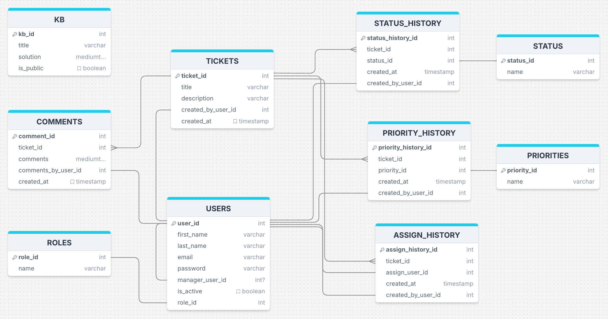

# SupportDesk

## Overview

SupportDesk is a platform designed to streamline and enhance the efficiency of customer support teams. It provides tools to manage the entire lifecycle of support tickets, from creation and prioritization to assignment, resolution, and closure. SupportDesk aims to promote a responsive, organized, and effective approach to customer support.

### Problem

Customer support teams often struggle with delayed response times, inconsistent customer experiences, lack of visibility and accountability, and overwhelming volumes of support requests. These challenges lead to customer dissatisfaction and inefficiencies within the support process. SupportDesk is designed to tackle these pain points by offering a centralized system for managing support tickets, ensuring that support teams can operate more efficiently and effectively.

### User Profile

SupportDesk is intended for use by customer support teams across various industries, including technology, retail, finance, and more. The primary users will be customer support agents, team leads, and managers. Special considerations include the need for a user-friendly interface, real-time updates, and role-based access control to ensure that users only see the information relevant to their role.

- **Agents**

  - **Create, View, Edit Tickets**: Can create new support tickets, view assigned tickets, and update ticket status, priority or details.
  - **Comment on Tickets**: Add comments to tickets they are working on or assigned to.
  - **Access Knowledge Base**: Create, search and view articles in the Knowledge Base to resolve issues.

- **Team Lead / Managers**

  - **Full Dashboard Access**: View comprehensive team performance, including ticket statistics and agent activities.
  - **Assign Tickets**: Can assign or reassign tickets to specific agents based on workload or expertise.
  - **Prioritize and Escalate Tickets**: Ability to change ticket priority or escalate issues to higher levels agents.
  - **View, Edit All Tickets**: Can view and edit any ticket in their org (Agents that report to them).
  - **Comment on Tickets**: Add comments to any ticket and provide guidance or feedback to agents.
  - **Manage Knowledge Base**: Create, edit, or delete articles in the Knowledge Base.

- **Customer**
  - **Submit Tickets**: Create new support tickets by providing details of their issues or questions.
  - **View Ticket Status**: Track the status of their submitted tickets, including updates and resolutions.
  - **Access Public Knowledge Base**: Search and view public articles in the Knowledge Base.

### Features

- **Ticket Creation and Management**: Users can create new support tickets, including details like issue description, and priority level.
- **Ticket Prioritization**: Tickets can be prioritized based on factors such as urgency, customer importance, and issue type.
- **Assignment and Escalation**: Tickets can be assigned to specific agents, with the ability to escalate tickets if needed.
- **Status Tracking**: Real-time tracking of ticket status, including updates on progress and resolution.
- **Automated Responses**: When a ticket is created, an automated response can be created with first troubleshooting steps, based on the ticket description, reducing response times.
- **Knowledge Base/FAQ**: A centralized repository of information that both agents and customers can access for self-service.
- **Reporting and Analytics**: Comprehensive reports on ticket volume, backlog, resolution times, and team performance.
- **Role-Based Access Control**: Different access levels for agents, team leads, and managers, ensuring data security and relevant visibility.
  

## Implementation

### Tech Stack

- **Styling**: Material UI, Sass and CSS for custom styles and animations.
- **Frontend**: React.js for building dynamic user interfaces.
- **Backend**: Node.js with Express for building the server-side logic.
- **Database**: MySQL for managing relational data.
- **Authentication**: Passport.js.
- **Libraries**:
  - `Knex.js` for SQL query building.
  - `axios` for making Http Requests from the browser.
  - `react-quill` for adding a WYSIWYG text editor.
  - `mui` Material UI, for styled components.
  - `passport` for authentication in Node.js.

### APIs

- **Third-Party AI**: For creating automated responses (OpenAI: https://platform.openai.com/docs/libraries/node-js-library).

### Sitemap

1. **Login/Sign Up**: User authentication pages.
2. **Dashboard**: Comprehensive overview of team performance, including ticket statistics, and KPIs.
3. **Ticket Management**: Create, view, edit, and manage support tickets.
4. **User & Roles**: Manage user information and roles.
5. **Notifications**: Real time update on ticket changes.
6. **Knowledge Base/FAQ**: Access to common issues and resolutions.

### Data

- **SQL Diagram**
  
- **ER Considerations**:
  - **ROLES, STATUS & PRIORITIES**: Tables to store roles, status and priority options, making it easier to populate dropdowns or lists.

### Endpoints

- **Tickets**

  - **GET /tickets**: Fetch all tickets.
  - **POST /tickets**: Create a new ticket.
  - **GET /tickets/status-summary**: Get a summary of ticket statuses.
  - **GET /tickets/priority-summary**: Get a summary of ticket priorities.
  - **GET /tickets/:id**: Fetch a single ticket by ID.
  - **PUT /tickets/:id**: Update a ticket by ID.
  - **GET /tickets/:id/comments**: Fetch comments for a specific ticket.
  - **POST /tickets/:id/comments**: Add a comment to a specific ticket.
  - **GET /tickets/:id/timeline**: Fetch the timeline of a specific ticket.

- **Users**

  - **GET /users**: Fetch all users.
  - **GET /users/notifications**: Get notifications for the authenticated user.
  - **GET /users/:id**: Fetch a specific user by ID.
  - **POST /users/:id**: Update a specific user by ID.
  - **GET /users/:id/reportingUsers**: Fetch reporting users for a specific user by ID.

- **KB**

  - **GET /kb**: Fetch all knowledge base articles.
  - **POST /kb**: Create a new knowledge base article.
  - **GET /kb/:id**: Fetch a specific knowledge base article by ID.
  - **PUT /kb/:id**: Update a specific knowledge base article by ID.

- **AI**
  - **POST /ai**: Get a ticket possible solution from the AI.

### Auth

Authentication will be implemented using Passport.js. Users will need to sign in to access features, with role-based access control ensuring that each user can only access appropriate data.

## Roadmap

### Sprint 1: Foundations (Weeks 1)

- Set up project structure and environment.
- Implement basic authentication (Sign Up, Login).
- Create database schema and create initial migrations/seeds.

### Sprint 2: Core Features (Weeks 2-3)

- Develop ticket creation, management, and status tracking.
- Implement ticket prioritization and assignment features.
- Create the dashboard with an overview of ticket stats.

### Sprint 3: Enhancements (Weeks 4)

- Integrate automated responses and knowledge base.
- Implement reporting and analytics.
- Finalize UI/UX design and polish user interface.

## Nice-to-haves

- **Teams**: Manage different Support Teams, each with their own set of data , not shared between teams.
- **Email API**: Sending automated email notifications.
- **AI-Powered Suggestions**: Integrate AI to suggest responses based on historical data.

## License

This project is licensed under the MIT License. See the [LICENSE](LICENSE) file for details.

# Setup and Installation

- [Client Setup](/client)
- [Server Setup](/server)
